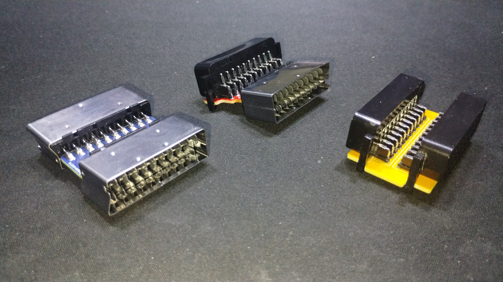
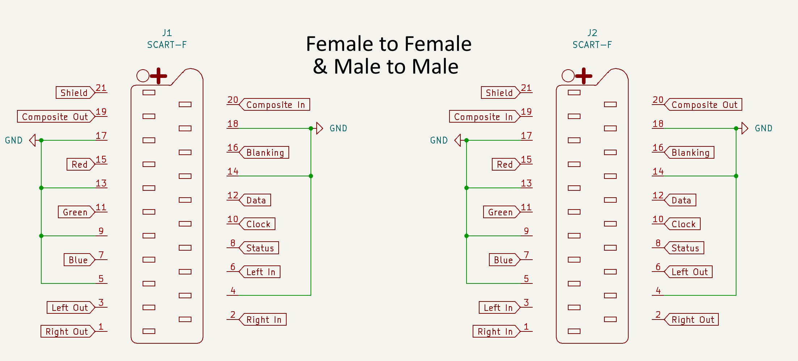
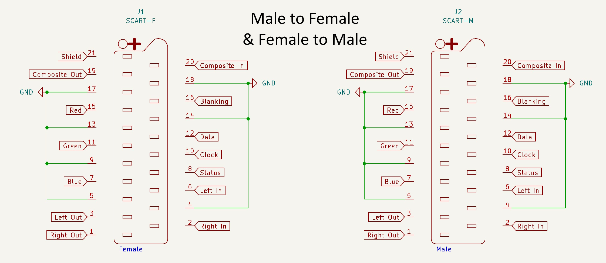
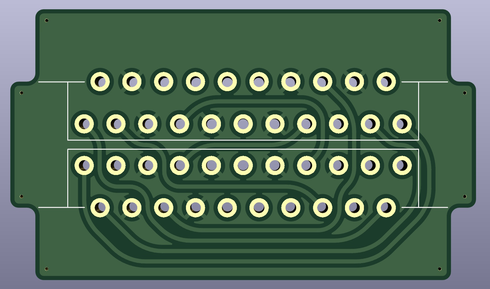
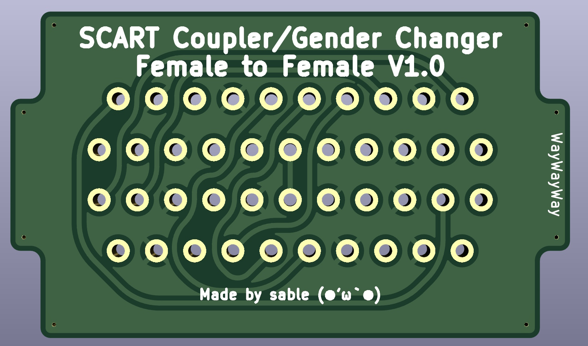
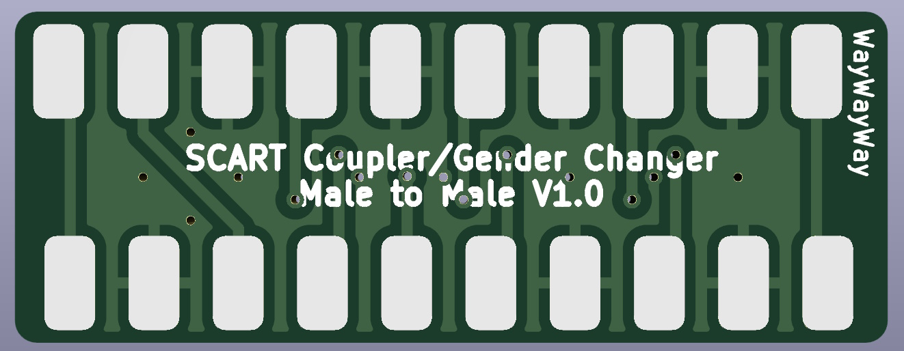
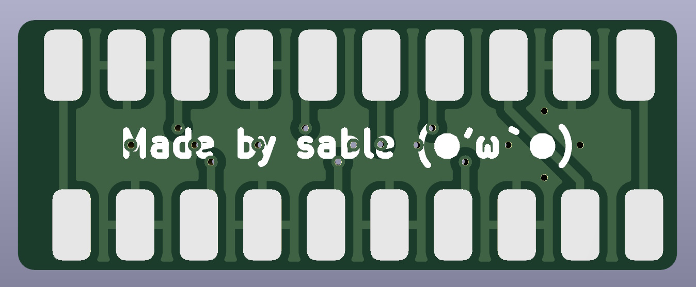
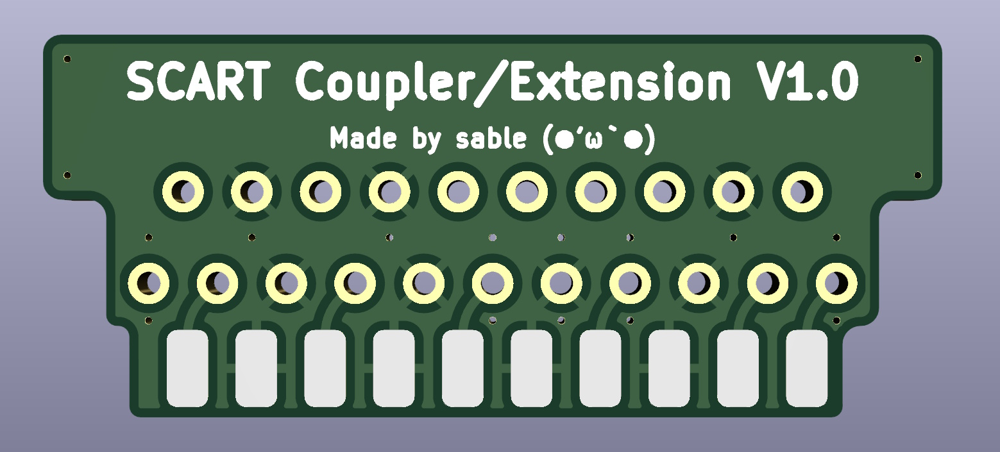
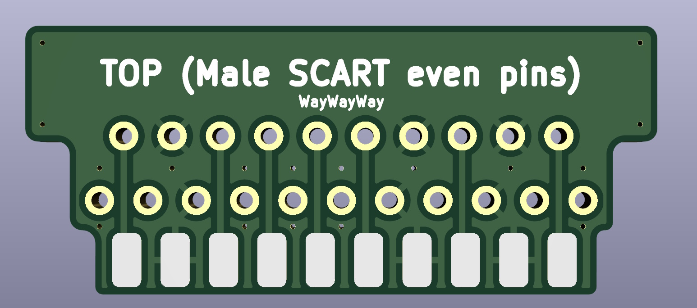

# SCARTCouplers
This repo is a collection of SCART (EuroSCART) Gender changers/couplers, schematics, as well as some information I found difficult to find/understand when dealing with the SCART standard.

# Why/About

When I was designing a [previous project](https://github.com/circuitsable/SCARTAudioExtractor), I had to fully understand the SCART standard for the project to be sucessful, which I found difficult to do. This may be due to my inexperience in dealing with connectors or understanding concepts of how the video signals being sent over the SCART cable work. This repository includes working schematics & PCBS for SCART gender changers/couplers, as well as a very short "cable", which would have helped me greatly when desinging my previous project.

I am hoping this information may be helpful to someone else, despite how easy this may be to figure out on your own or its nicheness.

# What you'll need

The PCB of your choice, of which gerbers are available for in the [releases](https://github.com/circuitsable/SCARTCouplers/releases/tag/gerbers). The PCB can be ordered from any board house, some examples of which are [Oshpark](https://oshpark.com/#services), [PCBWay](https://www.pcbway.com/QuickOrderOnline.aspx) or [JLCPCB](https://cart.jlcpcb.com/quote). Included in the releases are two versions, for PCBWay and JLCPCB respectively, which each have the board house's order number markers in the apropriate place.

*required items vary with chosen coupler, it should be obvious however*

Female SCART Connectors (specifically, [KYCON_SCART_K-SCARTX-022_Horizontal](https://www.mouser.com/datasheet/2/222/K-SCARTX-022-183347.pdf)). No major suppliers carry SCART connectors anymore as far as I'm aware, you can find listings on Aliexpress [here (LR Ear)](https://www.aliexpress.us/item/3256803860252051.html), [here (VER3)](https://www.aliexpress.us/item/2255800585241541.html) or [here (03)](https://www.aliexpress.us/item/3256806450160956.html). Ensure that the part that juts out is on the top (opposite side of the pins), the connector has ears, is a horizontal/90 degree connector, has all 21 pins (to ensure RGB support), and does not have any extra mounting methods besides the ears (e.g, screw holes).

Male SCART Connectors. No major suppliers carry SCART connectors anymore as far as I'm aware, you can find listings on Aliexpress [here](https://www.aliexpress.us/item/3256804790162926.html?). The outer shell cannot be soldered to, so it will not clamp to the connector very well, nor will it continue the shell's trace along the chain.

# Installation

Installation should be straight forward for the female connectors. The male connectors have a bigger gap than 1.6mm between their top and bottom pins, so the PCB may wiggle between them, and is quite hard to solder for this reason. Make sure to check that youre soldering it parallel to the PCB and that there is no angle (it will still work if there is, but it will be a little ugly).

The even side of the male connector is the side without the shell jutting out.

# Info

The [wikipedia page](https://en.wikipedia.org/wiki/SCART) on SCART says much more than I could and in a more concise manner. The standard documentation for SCART is still available for purchase, but can be found online as a [scanned document](http://fr.meric.free.fr/Articles/articlesba/stsurtvplat/Scart/BS_EN_50049-1%20Peritelevision%20connector.pdf).

## "Input" & "Output"

Looking at the pinout of the connector on wikipedia, there are pins labeled as input and output for the daisychainability of the connector and its signals. This caused me much confusion, as I was unsure if input meant that the signal traveling across the cable was an input to another device, or was the input from the previous device. Input is where you are meant to take in input, from the previous device. 

## Impedance matching

High frequency signals, including video signals, may have the traces they run along have a matching impedance to improve reliability of the signal. When dealing with the average signals sent over a SCART connection (cable or PCB traces, 240p/288p/480i/576i), this is not a concern.

## Grounding

It is okay to join most or all of the grounds together, including the shell. In theory the seperate grounds can help with the integrity of the signals, but in practice it is just fine.

## Termination

Termination (parallel or series) is only done at signal transmitters (e.g. game console) and signal recievers (e.g. television). Your cable/gender changer should ideally be 2 ports and connections between them, nothing else.

## Audio

The audio signal on a SCART cable is perfectly fine to tap into and use for more common audio connectors, such as a 3.5mm audio jack or RCA/phono jacks. The signal wont be too loud or anything like that.

# PCB Images & Schematics

